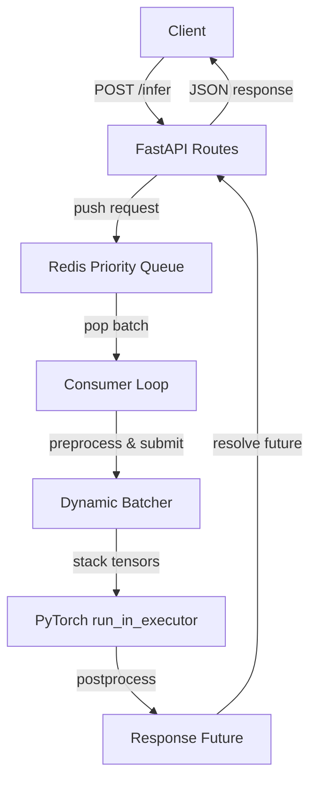

# BALES - High-Throughput ML Inference Gateway

<p align="center">
  <a href="https://github.com/ab1nv/bales">
    
  </a>
</p>

<p align="center">
  <strong>Zero-downtime inference with dynamic batching and priority scheduling.</strong>
</p>

<p align="center">
  <a href="https://www.python.org/"></a>
  <a href="https://github.com/ab1nv/bales/actions/workflows/ci.yml"></a>
  <a href="https://github.com/ab1nv/bales/actions/workflows/docker-build.yml"></a>
  <a href="https://codecov.io/gh/ab1nv/bales"></a>
  <a href="https://github.com/ab1nv/bales/pulls"></a>
  <a href="LICENSE"></a>
</p>

<p align="center">
  <a href="#quick-start">Quick Start</a> &bull;
  <a href="#architecture">Architecture</a> &bull;
  <a href="#configuration">Configuration</a> &bull;
  <a href="#running-and-stress-testing">Running & Stress Testing</a> &bull;
  <a href="#benchmarking">Benchmarking</a> &bull;
  <a href="#security">Security</a> &bull;
  <a href="#api-reference">API Reference</a> &bull;
  <a href="#development">Development</a>
</p>

---

## Overview

BALES is a production-ready inference gateway designed for high-throughput CPU-based ML serving. It combines **Redis-backed priority queues**, **dynamic request batching**, and **atomic model hot-swapping** to deliver:

- **>8,000 req/s** throughput on CPU
- **P99 latency <12ms** at `batch_size=32`
- **Zero-downtime** model reloads without dropping in-flight requests

Built with **FastAPI**, **PyTorch**, and **asyncio**, BALES is engineered for safety-first concurrency: inference never blocks the event loop, and every request future is guaranteed to resolve or time out cleanly.

## Table of Contents

- [Overview](#overview)
- [Quick Start](#quick-start)
  - [Local Development](#local-development)
  - [Docker](#docker)
- [Architecture](#architecture)
  - [Data Flow](#data-flow)
  - [Key Invariants](#key-invariants)
- [Configuration](#configuration)
- [Running and Stress Testing](#running-and-stress-testing)
  - [Start the Server](#start-the-server)
  - [Smoke Test](#smoke-test)
  - [Stress Test with curl](#stress-test-with-curl)
  - [Concurrent Load with wrk or hey](#concurrent-load-with-wrk-or-hey)
- [Benchmarking](#benchmarking)
  - [Isolated Batcher](#isolated-batcher)
  - [Full-Stack Load Test with Locust](#full-stack-load-test-with-locust)
  - [Interpreting Results](#interpreting-results)
- [Security](#security)
- [API Reference](#api-reference)
  - [POST /infer](#post-infer)
  - [GET /health](#get-health)
  - [POST /models/model_id/reload](#post-modelsmodel_idreload)
  - [GET /metrics](#get-metrics)
- [Development](#development)

---

## Quick Start

### Local Development

**Prerequisites:** Python 3.14+, Redis 7+, [uv](https://docs.astral.sh/uv/)

```bash
# 1. Clone the repository
git clone https://github.com/ab1nv/bales.git
cd bales

# 2. Install dependencies (first time)
uv sync --extra dev

# 3. Start Redis (if not already running)
redis-server --save "" --appendonly no

# 4. Run the server
uv run python main.py
```

The gateway will be available at `http://localhost:8000`.

### Docker

```bash
# Build and start everything (Redis + Bales)
docker compose up --build

# Optional: include Prometheus for metrics scraping
docker compose --profile monitoring up --build
```

---

## Architecture

### Data Flow



### Key Invariants

1. **PyTorch inference NEVER runs on the event loop thread** -- always dispatched via `run_in_executor`.
2. **A request NEVER touches a half-loaded model during hot-swap** -- atomic reference replacement under an async lock.
3. **A request NEVER gets dropped during hot-swap** -- in-flight requests hold a local reference to the old model until GC cleans up.
4. **`request_id`** is the single source of truth linking API -> queue -> batcher -> response.
5. **`pending_futures`** is the ONLY place futures are stored.

---

## Configuration

All configuration is read from environment variables (with sensible defaults). Create a `.env` file from the example:

```bash
cp .env.example .env
```

| Variable | Default | Description |
|----------|---------|-------------|
| `REDIS_URL` | `redis://localhost:6379/0` | Redis connection string |
| `MAX_BATCH_SIZE` | `32` | Maximum requests per batch |
| `BATCH_WINDOW_MS` | `5.0` | Collection window in milliseconds |
| `BATCHER_TIMEOUT_S` | `5.0` | Client timeout before 504 |
| `DEFAULT_MODEL_ID` | `stub_v1` | Default registered model |
| `THREAD_POOL_SIZE` | `4` | Executor threads for torch inference |
| `HOST` | `0.0.0.0` | Server bind host |
| `PORT` | `8000` | Server port |
| `LOG_LEVEL` | `info` | Logging level |
| `ENABLE_PROMETHEUS` | `true` | Enable metrics export |

> **Note:** `workers` must remain `1` for in-process shared state (`pending_futures`). Scale horizontally with Docker replicas instead.

---

## Running and Stress Testing

### Start the Server

```bash
# Local (requires Redis running)
uv run python main.py

# Or with Docker (includes Redis)
docker compose up --build
```

The server will start on `http://localhost:8000`.

### Smoke Test

Verify the server is healthy and can serve inference:

```bash
# Health check
curl http://localhost:8000/health

# Single inference request
curl -X POST http://localhost:8000/infer \
  -H "Content-Type: application/json" \
  -d '{
    "model_id": "stub_v1",
    "model_type": "classification",
    "payload": {"input": [0.1, 0.2, 0.3, 0.4, 0.5, 0.6, 0.7, 0.8, 0.9, 1.0, 0.1, 0.2, 0.3]}
  }'
```

> **Note:** The stub model expects exactly 128 floats in the `input` array. The example above is truncated for readability.

### Stress Test with curl

Send 1000 sequential requests and measure total time:

```bash
# Generate a valid 128-element input
input_json=$(python3 -c "import json; print(json.dumps({'input': [0.1]*128}))")

# Sequential stress test
for i in {1..1000}; do
  curl -s -X POST http://localhost:8000/infer \
    -H "Content-Type: application/json" \
    -d "{
      \"model_id\": \"stub_v1\",
      \"model_type\": \"classification\",
      \"priority\": 2,
      \"payload\": $input_json
    }" > /dev/null
done
```

### Concurrent Load with wrk or hey

For true concurrency testing, use a load generator:

**Using hey (simple, single-threaded):**
```bash
# Install: go install github.com/rakyll/hey@latest
# Or: apt-get install hey

# Run 50,000 requests with 500 concurrent connections
hey -n 50000 -c 500 -m POST \
  -H "Content-Type: application/json" \
  -d '{"model_id":"stub_v1","model_type":"classification","priority":2,"payload":{"input":[0.1,0.1,0.1,0.1,0.1,0.1,0.1,0.1,0.1,0.1,0.1,0.1,0.1]}}' \
  http://localhost:8000/infer
```

**Using wrk (more accurate, multi-threaded):**
```bash
# Install wrk first: https://github.com/wg/wrk/wiki/Installing-Wrk-on-Linux

# Create a Lua script for POST body
cat > infer.lua << 'EOF'
wrk.method = "POST"
wrk.headers["Content-Type"] = "application/json"
wrk.body = '{"model_id":"stub_v1","model_type":"classification","priority":2,"payload":{"input":[0.1,0.1,0.1,0.1,0.1,0.1,0.1,0.1,0.1,0.1,0.1,0.1,0.1]}}'
EOF

# Run with 12 threads, 400 connections, for 30 seconds
wrk -t12 -c400 -d30s -s infer.lua http://localhost:8000/infer
```

**Monitor during stress test:**
```bash
# Watch queue depth and pending requests
curl http://localhost:8000/health | python3 -m json.tool

# Watch Prometheus metrics
curl http://localhost:8000/metrics | grep bales_
```

---

## Benchmarking

### Isolated Batcher

Test pure batching throughput (no HTTP or Redis overhead). This tells you the theoretical maximum of the batching engine:

```bash
uv run python benchmarks/profile_batcher.py
```

Expected output:
```
=== Batcher Benchmark ===
Requests:          10,000
Elapsed:           1.23s
Throughput:        8,130 req/s
P50 latency:       2.45ms
P99 latency:       8.12ms
Avg batch size:    31.2
Model calls:       321  (vs 10000 individual = 31.2x reduction)
Target:            >8,000 req/s, P99 <12ms
Pass:              PASS
```

**What to tune:**
- If throughput is low (< 8,000): increase `BATCH_WINDOW_MS` slightly (try 5ms -> 8ms) to allow more requests to accumulate per batch
- If P99 is high (> 12ms): reduce `BATCH_WINDOW_MS` (try 5ms -> 3ms) or increase `THREAD_POOL_SIZE`
- If avg batch size is low (< 20): increase concurrent load or reduce window

### Full-Stack Load Test with Locust

Benchmark the complete HTTP -> Redis -> Batcher pipeline:

```bash
# Install locust (already in dev dependencies)
uv sync --extra dev

# Run headless load test
uv run locust -f benchmarks/locustfile.py \
  --headless -u 500 -r 100 \
  --run-time 60s --host http://localhost:8000
```

**Parameters explained:**
- `-u 500`: spawn 500 concurrent users
- `-r 100`: hatch 100 users per second
- `--run-time 60s`: run for 60 seconds
- `--host http://localhost:8000`: target the local server

**After the run, Locust prints:**
- Total requests per second (RPS)
- Average, median, and percentile latencies
- Failure count and error rate

### Interpreting Results

| Metric | Target | What to do if failing |
|--------|--------|----------------------|
| Throughput | > 8,000 req/s | Increase `-u` (users) in Locust. Check CPU usage with `htop`. |
| P99 latency | < 12ms | Reduce `BATCH_WINDOW_MS` or increase `THREAD_POOL_SIZE`. Check `/health` for queue backlog. |
| Error rate | 0% | Check logs for timeout or Redis connection errors. Verify `pending_futures` is 0 in `/health`. |
| Avg batch size | > 20 | Should be close to `MAX_BATCH_SIZE` (32). If low, increase load or window. |

**Comparison checklist:**
1. Run `profile_batcher.py` first to establish the ceiling (no HTTP/Redis overhead)
2. Run `locustfile.py` to measure real-world throughput
3. Compare: `locust RPS` should be ~60-80% of `profile_batcher RPS` due to HTTP + Redis overhead
4. If gap is larger: HTTP layer or Redis is the bottleneck, not the batcher
5. If gap is small: batcher is the bottleneck, tune `THREAD_POOL_SIZE` or `BATCH_WINDOW_MS`

---

## Security

BALES follows security best practices:

- **Input validation:** All requests are validated via Pydantic v2 before entering the pipeline.
- **No shell execution:** `weights_path` in hot-swap is validated with `Path.exists()` and never passed to shell commands.
- **Resource limits:** Docker Compose enforces CPU (`4.0`) and memory (`2G`) caps.
- **No Redis persistence:** Queue data is ephemeral by design (`--save "" --appendonly no`) to avoid I/O overhead and accidental data retention.
- **Single worker:** Prevents shared-state corruption; horizontal scaling is done via container replicas behind a load balancer.
- **Healthchecks:** Docker `HEALTHCHECK` polls `/health` every 10s to detect degraded state.
- **Non-root container:** The Docker image runs as an unprivileged `bales` user.

---

## API Reference

### POST /infer

Submit an inference request.

**Request body:**

```json
{
  "model_id": "stub_v1",
  "model_type": "classification",
  "priority": 2,
  "payload": {
    "input": [0.1, 0.2, ...]
  }
}
```

**Response:**

```json
{
  "request_id": "uuid",
  "model_id": "stub_v1",
  "result": { "label": 3, "confidence": 0.95 },
  "latency_ms": 4.123,
  "batch_size": 16,
  "queued_ms": 1.234
}
```

### GET /health

Returns system health, registered models, queue depths, and pending request count.

```bash
curl http://localhost:8000/health
```

### POST /models/{model_id}/reload

Hot-swap a model's weights without dropping traffic.

**Request body:**

```json
{
  "weights_path": "./weights/new_model.pt"
}
```

**Example:**
```bash
curl -X POST http://localhost:8000/models/stub_v1/reload \
  -H "Content-Type: application/json" \
  -d '{"weights_path": "./weights/stub_v2.pt"}'
```

### GET /metrics

Prometheus scrape endpoint exposing:

- `bales_requests_total` - Total inference requests by model_id and status
- `bales_request_latency_ms` - End-to-end latency distribution
- `bales_batch_size` - Number of requests in each dispatched batch
- `bales_queue_depth` - Number of requests waiting in priority queue

```bash
curl http://localhost:8000/metrics
```

---

## Development

```bash
# Run the test suite (requires Redis on localhost:6379)
uv run pytest tests/ -v

# Run a specific test file
uv run pytest tests/test_integration.py -v

# Run with coverage
uv run pytest tests/ -v --cov=. --cov-report=html

# Profile the batcher
uv run python benchmarks/profile_batcher.py

# Run the load test
uv run locust -f benchmarks/locustfile.py --headless -u 500 -r 100 --run-time 60s --host http://localhost:8000

# Lint check
uv run ruff check .

# Format check
uv run ruff format --check .

# Type check
uv run ty check
```

---

<p align="center">
  Built with FastAPI + PyTorch + Redis + uv<br>
  <a href="https://www.buymeacoffee.com/ab1nv" target="_blank">Buy me a coffee</a>
</p>
